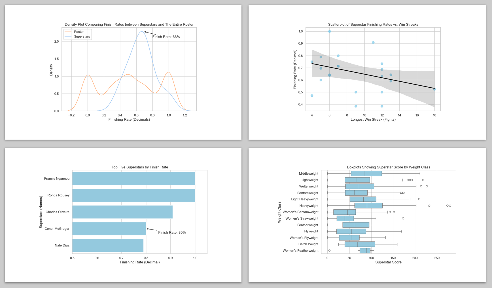

# UFC Scouting Project

This repository aims at using Python to provide insights into common superstar traits, comparing these traits to the average fighter, and producing a “Superstar Calculator” which intakes a fighter’s stats and outputs a “Superstar Score” indicating their potential.

## Skills/Tools Used

### Tools

Python, Pandas, Matplotlib, & Seaborn

### Python Skills 

Data loading, Data wrangling, Defining functions, For-loops, If-else statements, Feature engineering, DataFrame/Series manipulation, Matplotlib plot creation, Seaborn plot manipulation

### Statistical Skills 

Descriptive statistics, Comparative analysis, Correlation visualization, Trend visualization

## About the Project

### How to Get Started

To replicate this code, you will need to download the CSV titled “ufc-master.csv” from the original Dataset on Kaggle (the link can be found at the bottom of this README file). You will then need to open any code editor that can run Python. Import Pandas, Matplotlib, Seaborn, and the CSV file you downloaded. The code written in the data analysis is dependent on the code written in the data wrangling, so run this section first.

### Dataset Information

The dataset used in this repository is titled “Ultimate UFC Dataset” on Kaggle. It is based on all UFC fighter statistics from 2010 to 2024. The dataset includes over 3,000 UFC fighters, each with stats ranging from physical attributes (height, reach, etc.) to in-fight records (longest win streak, wins by submission, etc.). Data wrangling for this dataset requires the transformation of a per-fight index to a per-fighter index and involved the creation of a subset table called “superstars” for later comparisons.

### Key Findings

The results from the analysis of the data revealed that superstars tended to have long reaches, long winning streaks, and high finishing rates. When comparing these commonalities with the average UFC fighter, it was clear to see that superstars easily surpassed benchmark fighters in all three categories. The “Superstar Score” was created and used on the dataset and several specific fighters to display its credibility.

These insights and tools can be used to help MMA promotions find talent using quantitative analysis, allowing them to filter through various fighters and corroborate their intuition with what the numbers say. Doing this will increase success in prospect pipelines, leading to revenue-generating superstars.

## Links

[Original Dataset](https://www.kaggle.com/datasets/mdabbert/ultimate-ufc-dataset?select=ufc-master.csv)

[Portfolio Website](https://nicolaskiryczun.github.io/)
